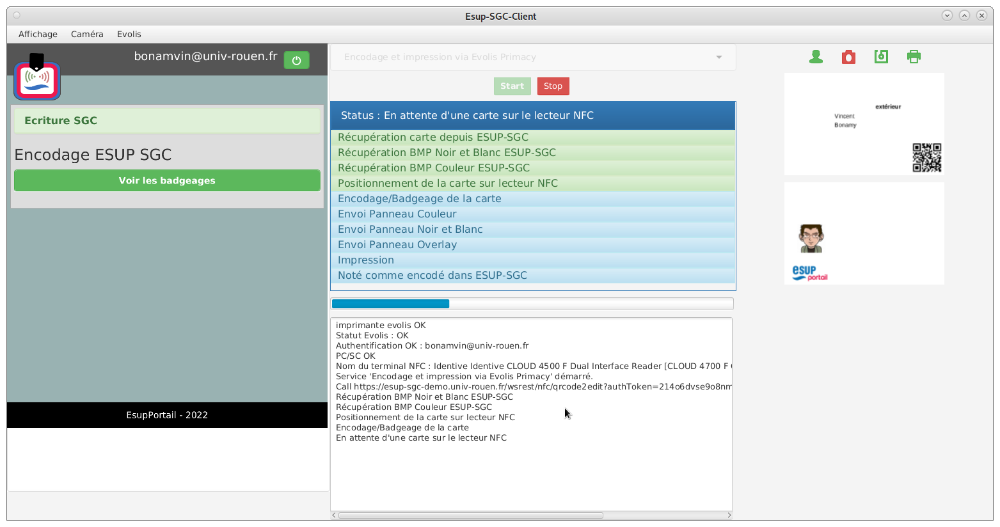

ESUP-SGC-CLIENT
===============

  * [Technologies](#technologies)
  * [Environnement de développement](#environnement-de-développement)
  * [SceneBuilder](#scenebuilder)
  * [Dépendances techniques](#dépendances-techniques)
    + [modules maven](#modules-maven)
    + [evolis](#evolis)
      - [evolis primacy 2](#evolis-primacy-2)
      - [evolis primacy 1](#evolis-primacy-1)
      - [autres imprimantes evolis](#autres-imprimantes-evolis)
      - [simulation de evolis](#simulation-de-evolis)
    + [zebra](#zebra)
      - [support sous Windows](#support-sous-windows)
      - [support sous Linux](#support-sous-linux)
    + [esup-nfc-tag et esup-sgc de démonstration](#esup-nfc-tag-et-esup-sgc-de-démonstration)
  * [Copie d'écran](#copie-décran)

Pour une documentation fonctionnelle de l'outil et sa mise en oeuvre, merci de vous référer 
à la documentation ici du wiki ESUP-Portail, notamment ici :
 * [projet global esup-sgc](https://www.esup-portail.org/wiki/display/SGC)
 * [page wiki ESUP spécifiique à esup-sgc-client](https://www.esup-portail.org/wiki/display/SGC/Clients+ESUP-SGC-CLIENT+v2.0)

Dans ces pages, on indique notamment que l'installation de cet outil en production est facilitée par un installateur 
qui peut lui-même être généré depuis un simple formulaire web en ligne via [esup-sgc-client-installer](https://github.com/EsupPortail/esup-sgc-client-installer)


## Technologies

esup-sgc-client est une application java/spring/javafx utilisant maven pour gérer la compilation 
et les dépendances des librairies utilisées.

Pour fonctionner, il requiert un openjdk 8 (ou supérieur) et openjfx

## Environnement de développement

Vous pouvez utiliser comme IDE Eclipse (depuis Spring Tools par exemple) ou IntelliJ IDEA pour le développement.

Vous pouvez lancer le projet via une simple commande maven ainsi : 
````
mvn javafx:run
````

Cependant, depuis votre IDE, le débogage via des points d'arrêt (breakpoint) risque de poser problème.
Il vaut mieux alors lancer le projet en tant qu'application java. Vous devrez alors spécifier les options javafx/openjfx 
en précissant les "VM Options" de ce type :
````
--module-path /usr/local/javafx-sdk-19/lib/ --add-modules javafx.controls,javafx.fxml,javafx.base,javafx.media,javafx.graphics,javafx.swing,javafx.web
````

Suivant le certificat utilisé par vos serveurs esup-sgc/esup-nfc-tag, et la version de java utilisée, vous devrez également rajouter dans les options java
````
-Djdk.tls.client.protocols=TLSv1.2
````

Pour activer le profile/module evolis dans l'IDE, vous pouvez ajouter le "classpath of module" `-cp esupsgclient-evolis` .

_Sous intelliJ, pour pouvoir sélectionner `-cp esupsgclient-evolis` vous devez au préalable activer le profile evolis dans la fenêtre maven (et recharger les projets maven)._

En optant pour `-cp esupsgclient-core` vous aurez le client sans module/profile supplémentaire.

Pour le profile/module zebra, vous pouvez ajouter le "classpath of module" `-cp esupsgclient-zebra` .

## SceneBuilder

L'interface homme machine (IHM / GUI) est décrite en FXML. 

Le fichier fxml donnant la scène applicative est [src/main/resources/esup-sgc-client.fxml](src/main/resources/esup-sgc-client.fxml)

Ce fichier est construit et maintenu grâce à [Scene Builder](https://gluonhq.com/products/scene-builder/)

Pour avoir un rendu proche de l'application lancée, il vous faut ajouter dans Scene Builder le fichier css 
[src/main/resources/bootstrapfx4scenebuilder.css](src/main/resources/bootstrapfx4scenebuilder.css) 
issu de [boostrapfx](https://github.com/kordamp/bootstrapfx)

boostrapfx étant en fait réellement intégré dans l'application en tant que librairie maven (comme pour toutes les librairies dont dépend esup-sgc-client)


## Dépendances techniques

esup-sgc-client fonctionne avec :
* requis
  * un serveur esup-nfc-tag 
  * un lecteur NFC USB permettant de passer des APDUs (notamment Mifare DESFIRE) via PC/SC, celui-ci peut correspondre au lecteur NFC de l'imprimante Evolis Primacy (1 ou 2) ou Zebra
* optionnel
  * une webcam 
  * une imprimante evolis primacy 1 ou 2 (ou plus exactement Evolis Premium Suite 1 ou 2) ou zebra
  * un serveur esup-sgc


### modules maven

Des sous-modules maven peuvent être utilisés pour ajouter le support aux imprimantes evolis ou zebra.
Pour ajouter le module evolis, vous pouvez ajouter `-P evolis` à vos commandes maven.
Pour zebra, ajoutez `-P zebra` à vos commandes maven

Ainsi
````
mvn -P evolis clean package
````
permet de récupérer le client esup-sg-client avec le module esupsgcclient-evolis ici : `esupsgcclient-assembly/target/esup-sgc-client-final.jar`

De même, pour lancer directement cette application avec esupsgcclient-evolis de chargé via maven, vous pouvez lancer :
````
mvn -P evolis clean javafx:run
````

Depuis votre IDE (intellij idea par exemple), vous pouvez travailler/lancer l'application en spécifiant le module via `-cp esupsgcclient-evolis` ;
la classe principale à lancer restant `org.esupportail.esupsgcclient.EsupSgcClientApplication`.

### evolis

#### evolis primacy 2

Il vous faut installer le driver de votre encodeur NFC intégré à votre Primacy 2
(Si vous avez opté pour un encodeur "SpringCard CrazyWriter" par exemple, vous trouverez le driver depuis https://www.springcard.com/en/download/drivers : "PC/SC Driver for USB couplers" / fichier sd16055-2104.exe).

Pour la primacy 2 en elle-même, il vous faut installer le "Evolis Premium Suite 2" depuis https://myplace.evolis.com/s/quick-install-step-4?language=fr

Notez que "Evolis Premium Suite 2" ne fonctionne que depuis Windows, le lecteur NFC ne fonctionne que via USB : le client esup-sgc-client doit donc être installé sur ce même windows ; en phase de développement on peut se contenter de manipuler à distance.

esup-sgc-client dialogue en effet par TCP avec "Evolis Premium Suite 2" qui se charge de retransmettre les ordres à l'imprimante.

Pour la phase d'encodage, une fois l'ordre donnée de positionner la carte au niveau de l'encodeur, esup-sgc-client dialogue directement avec l'encodeur NFC en pc/sc.

"Evolis Premium Suite 2" doit être configuré pour permettre cette communication par TCP.
Dans le répertoire bin de "Evolis Premium Suite 2" (dans Program Files), il vous faut modifier evoservice.properties: 
````
RequestServer.tcpport = 18000
RequestServer.tcpenabled = true
````

Une fois ces modifications apportées, vous devez redémarrer le servie windows "Evolis Premium Suite 2" (via la gestion classique des "service windows").

Le service et donc le PC windows hôte doit donc écouter en TCP sur le port 18000 en local, c'est par ce biais qu'esup-sgc-client dialogue avec l'imprimante.
En cas de problème d'écoute sur le port 18000, pensez à vérifier/adapter un éventuel firewall.

Le fichier de configuration d'esup-sgc-client donné dans [src/main/resources/esupsgcclient.properties](src/main/resources/esupsgcclient.properties) doit reprendre ce même numéro de port.

Notez que la configuration printerEvolisSet vous permet de configurer le type de ruban utilisé, 
par défaut on propose une configuration proposant l'usage d'un ruban couleur demi-panneau (RC_YMCKOS), pour un ruban couleur plein panneau il faudra positionner RC_YMCKO

Enfin nous vous conseillons de désactiver les notifications de l'application "Evolis Premium Suite 2" pour ne pas être gêné par des popups qui bloqueront le process d'édition des cartes pour vous
notifier d'un nettoyage de cartes à réaliser, d'une fin de ruban, etc. : pour ce faire, dans "Evolis Premium Suite 2", cliquez en haut à droite sur l'icône de "préférences utilisateurs" pour effectivement
désactiver les notifications. Les popups de notifications sont en effet bloquantes pour esup-sgc-client : l'impression est en attente tant que la popup n'a pas été acquittée ; durant ce laps de temps,
esup-sgc-client ne recevant pas de réponse à sa commande d'impression de carte, celui-ci tombe en erreur.

#### evolis primacy 1

La mise en place pour Evolis Primacy 1 (par rapport à Primacy 2) est très similaire, il vous faudra cependant installer non pas "Evolis Premium Suite 2" mais "Evolis Premium Suite".
Le fichier de configuration à modifier est C:\Program Files\Evolis Card Printer\Evolis Premium Suite\ESPFSvc.properties pour activer le support de la communication par TCP (port 18000) :
```
ESPFServerManager.enabletcpatstart = true
```

Au niveau d'esup-sgc-client, il faudra spécifier dans src/main/resources/esupsgcclient.properties :
```
printerDeviceName = Evolis Primacy
```

#### autres imprimantes evolis

Théoriquement, esup-sgc-client doit supporter les autres imprimantes evolis supportant "Evolis Premium Suite" (1 ou 2), il faudra alors adapter la propriété printerDeviceName en conséquence.

#### simulation de evolis

Pour le développement, on peut aussi se contenter de 'simuler' l'API de "Evolis Premium Suite" 
Pour ce faire, il vous suffit de lancer le script python (python2 ou python3) [src/etc/dummyEvolisPrinterCenter.py](src/etc/dummyEvolisPrinterCenter.py)
````
python3 dummyEvolisPrinterCenter.py
````

Ce script, basique, ne fait que répondre ``{"id":"1","jsonrpc":"2.0","result":"OK"}`` à toute requête émanant de esup-sgc-client.

Il est donc loin de 'simuler' à proprement parler les interactions avec evolis primacy 2; mais ça reste tout à fait suffisant pour une grand part du développement.

### zebra

En plus du driver Zebra récupérable depuis https://www.zebra.com/fr/fr/support-downloads/printers/card/zc300.html , il vous faut installer le driver de votre encodeur NFC intégré à votre Zebra.
Nous avons développé et donc validé le bon fonctionnement de l'imprimante Zebra ZC 300 dotée d'un encodeur ELATEC GmbH TWN4/B1.50/NPF4.51/S1SC1.60 (vous pouvez récupérer le nom de l'encodeur depuis le gestionnaire de périphériques windows ou plus simplement via un `lsusb` sous linux).

Pour que cet encodeur fonctionne correctement avec la Zebra ZC 300, il nous a fallu mettre à jour son firmware avec la version du firmware proposé dans le "DevPack 4.51" que l'on peut obtenir depuis https://www.elatec-rfid.com/int/twn4-dev-pack (en indiquant son mail).
Sans cette mise à jour de firmware (notre zebra ZC 300 reçue en février 2023 proposait un firmware ancien), l'encodeur était vu comme deux lecteurs NFC et n'était pas capable de lire les cartes Mifare Desfire.
Pour effectuer cette mise à jour du firmware, depuis un windows, et une fois récupéré et dézippé votre fichier TWN4DevPack45.zip, vous pouvez taper en ligne de commande : 
```
TWN4DevPack451\Tools\flash.exe --noprog USB TWN4DevPack451\Firmware\TWN4_xPx451_S1SC160_Multi_CCID_1Slot_Standard.bix
```
Cela vous permet de récupérer quelques informations, la mise à jour du firmware effective étant faite par la commande : 
```
TWN4DevPack451\Tools\flash.exe USB TWN4DevPack451\Firmware\TWN4_xPx451_S1SC160_Multi_CCID_1Slot_Standard.bix
```

En plus du driver Zebra et du firmware (du lecteur NFC, celui de la Zebra étant sans doute déjà jour) à mettre éventuellement à jour, il vous faut également télécharger le SDK Zebra depuis https://www.zebra.com/fr/fr/support-downloads/printer-software/developer-tools/card-sdk.html
Celui-ci a pour nom "LINK-OS MULTIPLATFORM SDK FOR CARD PRINTERS", nous avons utilisé la version v2.14.5198 de ce SDK.

Le répertoire dans lequel le SDK est ainsi installé (et sa version) doit être positionné dans esupsgcclient-zebra/pom.xml 
```
    <zebra.link_os_sdk.lib>/opt/link_os_sdk/PC-Card/v2.14.5198/lib</zebra.link_os_sdk.lib>
    <zebra.link_os_sdk.version>v2.14.5198</zebra.link_os_sdk.version>
```

Une fois le SDK téléchargé et configuré dans ce fichier, vous devez taper la commande suivante pour le faire connaitre à maven : 
```
mvn -P zebra initialize
```

Comme pour les evolis, le lecteur NFC ne fonctionne que via USB : le client esup-sgc-client doit donc être installé sur le poste (windows ou linux) connecté en USB à l'imprimante.

Pour la phase d'encodage, une fois l'ordre donnée de positionner la carte au niveau de l'encodeur, esup-sgc-client dialogue directement avec l'encodeur NFC en pc/sc.

Dans le fichier de propriétés src/main/resources/esupsgcclient.properties, suivant votre imprimante (et son firmware), vous devrez éventuellement adapter la propriété printerZebraEncoderType

Si la ZC300 attend a priori 'other' pour spécifier le lecteur NFC USB intégré à celle-ci, la ZXP3 attend par exemple 'MIFARE'.

Notez que la Zebra ZC 300 (avec l'encodeur cité) fonctionne aussi bien sous windows que sous linux.

Concernant la ZXP3, le SDK java fourni par Zebra pose nativement un problème avec les demi-panneaux, un contournement est proposé dans esup-sgc-client pour que cela fonctionne, 
pour ce faire il suffit de positionner printerZebraHackZxp3HalfBug à true dans esupsgcclient.properties (ou via une variable d'environnement).

printerZebraHackZxp3HalfBug à true permet également de ne pas appeler la méthode close de la DLL Zebra qui provoque un crash JVM sous windows. 

Mettre printerZebraRotation à true (false par défaut) permet de retourner la carte avant impression (il faut alors adapter le positionnement de la carte dans l'imprimante).
Ce paramètre est utile pour la Zebra ZXP3 avec les demi-panneaux : sur ZXP3 c'est au SDK de gérer le positionnement du demi-pannaeu (et non à l'imprimante comme sur ZXP7 ou ZC300), et celui-ci
ne le fait pas correctement ; en faisant en sorte que la partie couleur soit sur la gauche de la carte lors de l'impression (au début), cela facilite le calcul du décalage par le SDK.
-> à utiliser sur ZXP3 avec les demi-panneaux si vous avez des problèmes de décalage (et photo/logo couleur flouté). 

printerZebraHackZxpNfcPower permet quant à lui d'inverser la commande d'alimentation du lecteur NFC ; 
cela est nécessaire si vous avez mis à jour le firmware du lecteur NFC fourni avec la ZXP3 avec le firmware officiel (SDI010 d'identiv) ;
ce que l'on vous déconseille de faire ; cela permet de le faire fonctionner sous linux le lecteur NFC mais de manière instable (de nos tests, des erreurs pc/sc peuvent survenir), de plus la mise à jour du firmware est **irréversible**
car le firmware initial est celui de zebra qui est non disponible au téléchargement.

#### support sous Windows

Sous windows, dans les variables d'environnement, ajoutez le répertoire pointant vers la librairie (et DLL) du SDK Zebra dans le PATH.

Dans variable d'environnement < variables systemes < Path, on ajoute ainsi (v2.14.5198 étant la dernière version du SDK en date au 25/08/2023) :
"C:\Program Files\Zebra Technologies\link_os_sdk\PC-Card\v2.14.5198\lib"

Lorsque le PATH est bien pris en compte, sans imprimante de connectée, on doit retrouver dans les logs d'esup-sgc-client un WARN du type ci-dessous toutes les 3 secondes environ : 
```
6739 [Thread-5] WARN org.esupportail.esupsgcclient.service.printer.zebra.ZebraPrinterService.init(ZebraPrinterService.java:212)  - Cant connect Zebra printer, retry in 3 sec
```

Ensuite, avec le path bien positionné, et avec une imprimante Zebra de branchée, 2 cas de figure se produisent, suivant la JVM utilisée :
* crash (core dump) avec la plupart des JVM - ce problème est connu et référencé dans plusieyrs pages : [ici](https://developer.zebra.com/content/zsdkapi-crashing-jvm) et [là](https://developer.zebra.com/content/zebranativeusbadapter64dll-and-jdk-9) par exemple.
* un fonctionnement correct : l'imprimante est bien reconnue et l'icône dans esup-sgc-client devient ainsi verte, on peut alors lancer un 'stress test pc/sc' depuis le menu zebra

La difficulté de la mise en oeuvre sous windows réside donc à trouver une JVM (JDK ou JRE) supportant le SDK Zebra.

Des tests effectués, on estime que les JRE suivantes fonctionnent bien : 
 * versions JRE 1.8 proposées par Oracle jusqu'à la 1.8.0_251 inclue ; pour utiliser en production ue JRE sans vous acquitter d'un droit de licence, prenez la version **8u202** (dernière en date avec une licence gratuite pour un usage en production) : vous pouvez trouver ces anciennes versions dans [la page de téléchargement présentant ces archives](https://www.oracle.com/fr/java/technologies/javase/javase8-archive-downloads.html).
 
Si les versions en 32 bits comme la zulu JRE/JFX 11 en 32 bits proposées sur [AZUL](https://www.azul.com/downloads/?version=java-11-lts&os=windows&architecture=x86-32-bit&package=jre-fx#zulu) 
sont compatibles avec le SDK Zebra, elles ne le sont pas complètement avec les technologies JFX utilisées par esup-sgc-client, on peut alors obtenir sur certaines actions (formulaires html webview pour l'authentification depuis un WAYF shibboleth notamment) une erreur du type
```
7036 [JavaFX Application Thread] ERROR org.esupportail.esupsgcclient.ui.JavaScriptConsoleBridge.windowerror(JavaScriptConsoleBridge.java:32)  - Window Javascript : ReferenceError: Can't find variable: $
```
Ce qui peut rendre esup-sgc-client difficilement utilisable (notamment pour la partie authentification) ; si tel est le cas, on vous conseille donc d'utiliser la JRE  1.8.0_202 d'Oracle.

Pour tester sous windows, le plus pratique est de lancer une commande DOS et d'utiliser java.exe (et non javaw.exe) en ligne de commandes, ce qui permet 
d'avoir le retour (logs) directement dans la commande DOS.
On lance donc dans sous dos (cmd) une commande type :
```
"C:\Program Files\EsupSgcClient\java\bin\java.exe"
-Dcom.sun.webkit.useHTTP2Loader=false -DprinterZebraEncoderType=other
-jar esup-sgc-client-zebra.jar
```

Préalablement, vous pouvez vérifier que le répertoire lib du SDK est bien positionné dans votre PATH également ainsi : 
```
echo %PATH%
```
Résultat type :
```
C:\Program Files\Zebra Technologies\link_os_sdk\PC-Card\v2.14.5198\lib;C:\Window
s\system32;C:\Windows;C:\Windows\System32\Wbem;C:\Windows\System32\WindowsPowerS
hell\v1.0\
```

#### support sous Linux

Sous linux, le dialogue PC/SC avec l'encodeur est réalisé grâce à pcscd avec les pilotes proposés dans libccid.
Le dialogue avec l'imprimante nécessite que l'utilisateur ait les droits de lecture/écriture sur le fichier de périphérique (sous peine d'une erreur de type "USB error 3: Unable to open device: Access denied (insufficient permissions)").
Exemple pour debian : un ls -l sur le /dev nous indique qu'il suffit pour ce faire de mettre l'utilisateur dans les groupes dialout et lp.
```
adduser vincent dialout
adduser vincent lp
```

Notez que sous linux, contrairement à sous windows, nous n'avons pas rencontré de difficultés de compatibilité avec les JVM (JDK/JRE) que l'on a pu tester.
De fait, et tant que Zebra n'aura pas réglé ses problèmes de compatibilités avec les JVM sous wondows, on recommande plutôt d'utiliser les Zebra depuis des postes linux.

### esup-nfc-tag et esup-sgc de démonstration

A défaut d'installer un [serveur esup-nfc-tag](https://github.com/EsupPortail/esup-nfc-tag-server) 
et un [serveur esup-sgc](https://github.com/EsupPortail/esup-sgc) et de le configurer complètement 
pour avoir un environnement de développement complet, vous pouvez opter pour simplement utiliser la [plateforme de démonstration esup-sgc](https://www.esup-portail.org/wiki/pages/viewpage.action?pageId=615547103)
accessible à tout personnel de l'ESR au travers de la fédération ESR portée par RENATER.

Pour ce faire, vous n'avez qu'à spécifier dans [esupsgcclient.properties](src/main/resources/esupsgcclient.properties) les configurations suivantes : 
````
esupSgcUrl = https://esup-sgc-demo.univ-rouen.fr
esupNfcTagServerUrl = https://esup-nfc-tag-demo.univ-rouen.f
````

Finalement, avec la plateforme de démonstration et la simulation de evolis primacy 2, vous n'avez besoin réellement 
que d'une webcam et d'un lecteur NFC USB pour disposer de l'ensemble des dépendances matérielles et logicielles
(requises comme optionnelles) pour prendre part au développement d'esup-sgc-client.

Vous pouvez aussi tester esup-sgc-client depuis [la machine virtuelle de démonstration](https://www.esup-portail.org/wiki/display/SGC/VM+ESUP-SGC) qui propose par ailleurs 
par défaut l'usage de l'imprimante evolis 'simulée' via le script python [src/etc/dummyEvolisPrinterCenter.py](src/etc/dummyEvolisPrinterCenter.py).

## Copie d'écran



